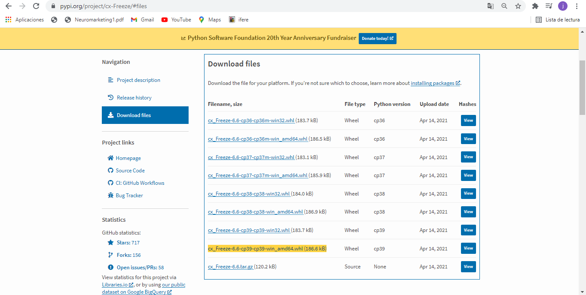

## Transformar programa en Python a un archivo Ejecutable Utilizando librería cx_Freeze

En este breve tutorial vamos a ver como crear un archivo ejecutable (.exe en windows) para poder ejecutar nuestro programa en cualquier dispositivo windows sin la necesidad de tener Python instalado previamente.


Antes de comenzar este tutorial se recomienda que ya tengas tu proyecto Python terminado, libre de errores para que este procedimiento sólo se haga una vez, puesto que para probar tu programa no necesitas crear un archivo .exe. Además obviamente se necesita tener instalado una versión de Python instalada (este tutorial está hecho para versiones 3.6 hasta 3.9) y el instalador de paquetes $pip$.

Teniendo esto en cuenta ya podemos comenzar instalando la librería que usaremos para crear nuestro ejecutable.

### 1. Instalando librería cx_Freeze

Antes de hacer cualquier descarga e instalación debemos verificar la versión de Python instalada en nuestro dispositivo.
Para ellos tenemos que dirigirnos hacia la consola del sistema (CMD) y escribir el siguiente comando: `python -V` o en su defecto `python --version`. La salida que deberíamos obtener será algo como esto:
````
C:\Users\joaqu\OneDrive\Escritorio\Juego INFO073 2021>python -V
**Python 3.9.0**

C:\Users\joaqu\OneDrive\Escritorio\Juego INFO073 2021>
````
Esto nos indica que tenemos la versión 3.9 de Python. Si usted tiene una versión anterior a la 3.6 le recomiendo que instale una versión más reciente.

Ahora es importante que usted haya verificado la versión de Python que posee, dado que vamos a dirigirnos a la pagina de PYPI para descargar la librería `cx_Freeze`. Ingrese al siguiente enlace [PYPI cx_Freeze](https://pypi.org/project/cx-Freeze/#files) y busque el archivo con un nombre similar a este `cx_Freeze-6.6-cp39-cp39-win_amd64.whl(186.6 kB)`pero que tenga la versión de Python que usted tenga instalada.



Ahora que tiene descargada la librería, demos instalarla. Para ello, a través del CMD debemos movernos al directorio donde se haya guardado la descarga. Una vez ubicado en esta carpeta, dentro de la consola (CMD) debe ejecutar el siguiente comando 
`pip install cx_Freeze-6.6-cp39-cp39-win_amd64.whl`
o si usa pip3
`pip3 install cx_Freeze-6.6-cp39-cp39-win_amd64.whl`

Este es el comando para el archivo cuya versión de Python 3.9, pero usted debe hacerlo con el archivo que acaba de descargar.

**insertat img**

Con esto ya tenemos la libaría instalada. Ahora vamos a crear el script de Python que se encargara de formar el ejecutable.

### 2. Creando archivo setup.

En nuestro editor de código preferido crearemos un nuevo archivo con nombre: `setup.py` en la misma carpeta que se encuentre el archivo que arranca el programa. Dentro de este archivo pegaremos el siguiente código:

```d
import cx_Freeze
import sys

cx_Freeze.setup(
	name="Nombre del Programa (Juego)",
	version="0.0.1",
	options={"build_exe": {"packages": ["pygame"],
						   "include_files":["img1.png", "img2.png"]}
		    },
	executables=[cx_Freeze.Executable("main.py")]
)
```
El valor de estos parámetros son los siguientes:

> `name`: String que representa el nombre del programa.
>`version`: Versión de nuestro programa.
>`options`: En esta sección pondremos las librerías de las que dependen nuestro programa, por ejemplo, pygame. En include_files pondremos una lista con los archivos externos que usaremos en nuestro programa(imagenes, sondidos, etc).
>`executables`:  Como parámetro de `cx_Freeze.Executable()`pondremos el nombre del archivo Python que arranca nuestro juego. Es el que ustedes ejecutan cuando van a probar el juego.


### 3. Creando ejecutable.

Este es nuestro último paso del tutorial, donde finalmente podremos crear el ansiado ejecutable.

Nos dirigiremos nuevamente al cmd y nos ubicaremos en la carpeta donde se encuentre el archivo que arranca el programa y escribiremos el siguiente comando
`python setup.py build` y esperamos a que este proceso termine.

Cuando haya terminado nos dirigimos a la carpeta de nuestro Programa (Juego) y veremos una nueva carpeta llamada `build`. Aquí es donde estará guardada nuestro ejecutable. 

**insertar imgs**
